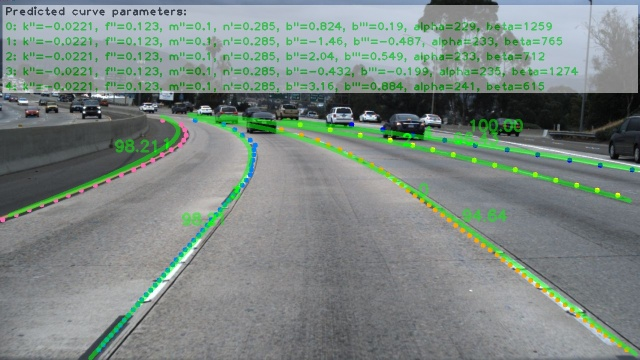

**LSTR**: Lane Shape Prediction with Transformers
=======


* 😎End-to-end architecture: Directly output lane shape parameters.
* ⚡Super lightweight: The number of model parameters is only 765,787.
* ⚡Super low complexity: The number of MACs (1 MAC = 2 FLOP) is only 574.280M.
* 😎Training friendly: Lower GPU memory cost. Input (360, 640, 3) with batch_size 16 uses 1245MiB GPU usages.


PyTorch(1.5.0) training, evaluating and pretrained models for LSTR (Lane Shape Prediction with Transformers).
We streamline the lane detection to a single-stage framework by proposing a novel lane shape model that achieves 96.18
TuSimple accuracy.

For details see [End-to-end Lane Shape Prediction with Transformers](https://arxiv.org/pdf/2011.04233.pdf) by Ruijin Liu, Zejian Yuan, Tie Liu, Zhiliang Xiong.

## Updates!!
* 【2021/12/03】 Our new work Learning to Predict 3D Lane Shape and Camera Pose  from a Single Image via Geometry Constraints by Ruijin Liu, Dapeng Chen, Tie Liu, Zhiliang Xiong, Zejian Yuan is accepted by AAAI2022! The preprint paper and codes will be released soon!
* 【2021/11/23】 We now support [Train and Test Custom Data](https://github.com/liuruijin17/LSTR/tree/custom).
Tutorial: [Train and Test Your Custom Data](https://github.com/liuruijin17/LSTR/blob/custom/docs/train_test_custom_data.md).

* 【2021/11/16】 We fix the [Multi-GPU Training](https://github.com/liuruijin17/LSTR/tree/multiGPU).
* 【2020/12/06】 We now support [CULane Dataset](https://github.com/liuruijin17/LSTR/tree/culane).

## Comming soon
- [ ] LSTR-nano(New backbone): 96.33 TuSimple accuracy with only 40% MACs (229.419M) and 40% #Params (302,546) of LSTR.
- [ ] Mosaic Augmentation.
- [ ] Loguru based logger module.
- [ ] Geometry based loss functions.
- [ ] Segmentation prior.


## Model Zoo
We provide the baseline LSTR model file (trained on TuSimple train and val sets after 500000 iterations) in
the ./cache/nnet/LSTR/LSTR_500000.pkl (~3.1MB).


## Data Preparation
Download and extract TuSimple train, val and test with annotations from [TuSimple](https://github.com/TuSimple/tusimple-benchmark).
We expect the directory structure to be the following:
```
TuSimple/
    LaneDetection/
        clips/
        label_data_0313.json
        label_data_0531.json
        label_data_0601.json
        test_label.json
    LSTR/
```

## Set Envirionment

* Linux ubuntu 16.04


```
conda env create --name lstr --file environment.txt
```

After you create the environment, activate it

```
conda activate lstr
```

Then

```
pip install -r requirements.txt
```

## Training and Evaluation

To train a model:

(if you only want to use the train set, please see ./config/LSTR.json and
set "train_split": "train")
```
python train.py LSTR
```
* Visualized images are in ./results during training.
* Saved model files (every 5000 iterations) are in ./cache during training.

To train a model from a snapshot model file:
```
python train.py LSTR --iter 500000
```

To evaluate (GPU 603MiB usage when evaluating single image iteratively), then you will see the paper's result:
```
python test.py LSTR --testiter 500000 --modality eval --split testing
```

To evaluate FPS (set --batch to maximum the FPS, GPU 877MiB usage if you repeat each image 16 times):
```
python test.py LSTR --testiter 500000 --modality eval --split testing --batch 16
```

To evaluate and save detected images in ./results/LSTR/500000/testing/lane_debug:
```
python test.py LSTR --testiter 500000 --modality eval --split testing --debug
```

* Demo (displayed parameters are rounded to three significant figures.)



To evaluate and save decoder attention maps (store --debugEnc to visualize encoder attention maps):
```
python test.py LSTR --testiter 500000 --modality eval --split testing --debug --debugDec
```

To evaluate on a set of images (store your images in ./images, then the detected results will be saved in ./detections):
```
python test.py LSTR --testiter 500000 --modality images --image_root ./ --debug
```

## Citation
```
@InProceedings{LSTR,
author = {Ruijin Liu and Zejian Yuan and Tie Liu and Zhiliang Xiong},
title = {End-to-end Lane Shape Prediction with Transformers},
booktitle = {WACV},
year = {2021}
}
```

## License
LSTR is released under BSD 3-Clause License. Please see [LICENSE](LICENSE) file for more information.

## Contributing
We actively welcome your pull requests!

## Acknowledgements

[DETR](https://github.com/facebookresearch/detr)

[PolyLaneNet](https://github.com/lucastabelini/PolyLaneNet)

[CornerNet](https://github.com/princeton-vl/CornerNet)
